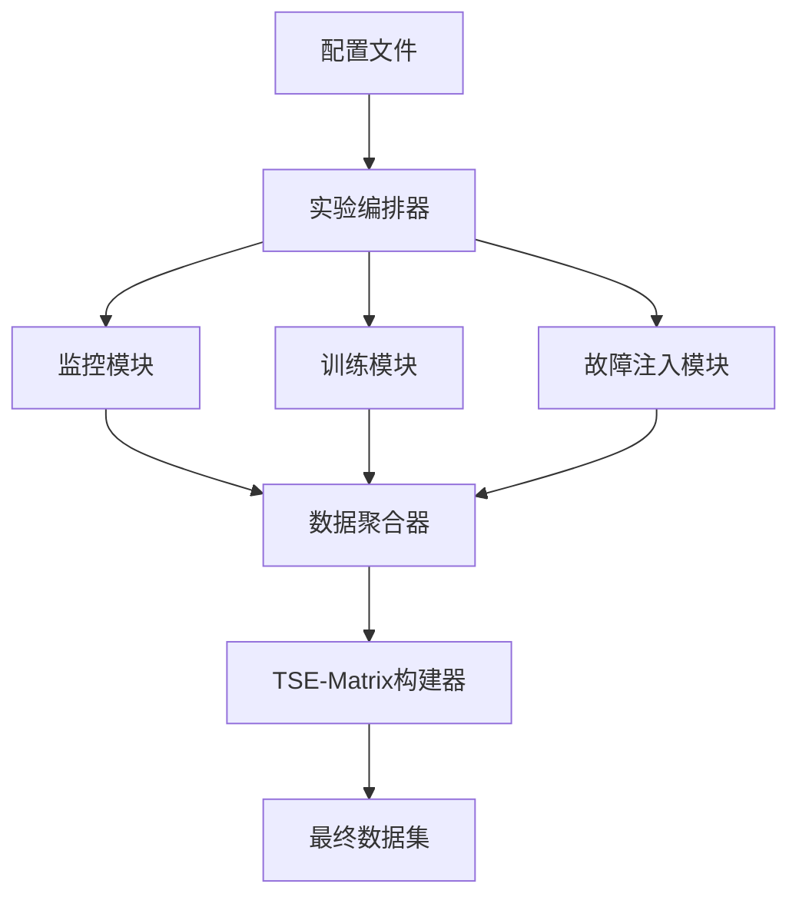

# MONI项目完整工作流解析

基于对您项目的深入分析，我为您清晰地梳理整个moni项目的工作模式和运行流程。

## 🏗️ 项目架构概览

您的moni项目采用**"观测器-执行器-注入器-聚合器"**四层架构：

```
观测器 (Observer) ←→ 执行器 (Executor) ←→ 注入器 (Injector)
       ↓                    ↓                    ↓
               数据聚合模块 (Aggregator)
                     ↓
              TSE-Matrix + Ground Truth
```

## 🔄 核心工作流程

### 阶段1：实验准备

```
配置文件 → 实验编排器 → 环境初始化
```

- **输入**：[`configs/`](configs/)目录下的YAML配置文件
- **处理**：[`experiments/multi_model_orchestrator.py`](experiments/multi_model_orchestrator.py:30)协调整个实验
- **输出**：实验计划、环境检查结果

### 阶段2：监控启动

```
GPU监控 ←→ 系统监控 ←→ 训练日志监控
```

- **GPU监控**：[`src/observer/gpu_monitor.py`](src/observer/gpu_monitor.py:31) - 实时监控GPU利用率、内存、温度
- **系统监控**：[`src/observer/system_monitor.py`](src/observer/system_monitor.py:1) - 监控CPU、内存、磁盘
- **训练监控**：[`src/executor/train.py`](src/executor/train.py:45) - 记录训练指标和事件

### 阶段3：训练执行 + 故障注入

```
模型训练 ←→ 故障注入 ←→ 异常检测
```

- **训练执行**：[`src/executor/train.py`](src/executor/train.py:245) - BERT模型训练
- **故障注入**：[`src/injector/fault_injector.py`](src/injector/fault_injector.py:1) - 按计划注入6种故障
- **异常检测**：实时检测NaN Loss、内存溢出等异常

### 阶段4：数据聚合

```
多源数据 → 时间对齐 → 特征工程
```

- **数据聚合**：[`src/aggregator/data_aggregator.py`](src/aggregator/data_aggregator.py:1) - 合并GPU、系统、训练数据
- **时间对齐**：按时间戳对齐所有数据源
- **特征工程**：计算移动平均、变化率等派生特征

### 阶段5：TSE-Matrix构建

```
聚合数据 → Ground Truth标注 → TSE-Matrix
```

- **矩阵构建**：[`src/aggregator/tse_matrix_builder.py`](src/aggregator/tse_matrix_builder.py:17) - 构建时间序列异常检测矩阵
- **标注生成**：基于故障注入时间生成精确的异常标签
- **数据存储**：保存为CSV格式供后续分析使用

## 🎯 三种运行模式

### 模式1：本地实验（简单验证）

```bash
python run_local_experiment.py
```

**工作流**：

1. 模拟训练过程生成日志
2. 监控系统资源使用情况  
3. 聚合数据生成简单数据集
4. **输出**：`local_aggregated_data.csv`

### 模式2：GPU实验（Colab推荐）

```bash
python run_gpu_experiment.py
```

**工作流**：

1. 检查GPU环境并安装依赖
2. 启动真实BERT模型训练
3. 实时监控GPU使用情况
4. 注入真实故障并收集数据
5. **输出**：`gpu_system_metrics.csv` + `gpu_training.log`

### 模式3：多模型编排（高级研究）

```bash
python experiments/multi_model_orchestrator.py --plan-name my_experiment
```

**工作流**：

1. 创建包含多个模型、数据集、故障类型的实验计划
2. 并行运行所有实验组合
3. 使用大型数据集管理器优化存储
4. 生成综合实验报告
5. **输出**：大规模多模型异常检测数据集

## 📁 文件生成流程

```
运行实验 → 生成原始数据 → 数据聚合 → TSE-Matrix构建
   ↓           ↓              ↓            ↓
监控日志     GPU指标       聚合数据    最终数据集
训练日志    系统指标       特征工程    Ground Truth
```

**关键输出文件**：

- **原始数据**：`gpu_metrics.csv`, `system_metrics.csv`, `training_metrics.csv`
- **聚合数据**：`aggregated_data.csv`  
- **最终数据集**：`*_tse_matrix.csv`, `*_ground_truth.csv`
- **实验报告**：`*_report.json`, `*_metadata.yaml`

## 🔧 配置驱动的工作流

您的项目采用**配置驱动**的设计模式：

### 1. 训练配置

[`configs/training_config.yaml`](configs/training_config.yaml:1)控制：

- 模型类型和参数
- 训练超参数
- 硬件设置（CPU/GPU）

### 2. 故障配置  

[`configs/fault_injection_config.yaml`](configs/fault_injection_config.yaml:1)定义：

- 6种故障类型（NaN Loss、OOM、I/O瓶颈等）
- 注入时间和持续时间
- 故障参数和严重程度

### 3. 监控配置

[`configs/monitoring_config.yaml`](configs/monitoring_config.yaml:1)设置：

- 监控指标选择
- 采样频率
- 数据存储格式

## 🎪 模块交互关系



## 💡 简化使用建议

对于您的Google Colab GPU实验，推荐**三步法**：

### 第一步：环境设置

```python
!git clone https://github.com/Shirlig-bxl/moni.git
%cd moni
!pip install -r requirements.txt
```

### 第二步：运行实验

```python
!python run_gpu_experiment.py
```

### 第三步：获取数据

```python
import pandas as pd
data = pd.read_csv("gpu_system_metrics.csv")
print(f"收集了 {len(data)} 条GPU监控记录")
```

## 🎯 核心价值输出

您的项目最终生成：

1. **多源时间序列数据** - GPU、系统、训练指标的时间对齐数据
2. **精确Ground Truth** - 基于故障注入的精确异常标注
3. **TSE-Matrix格式** - 标准化的异常检测数据集格式
4. **大规模实验数据** - 支持多模型、多数据集的批量实验

这个架构设计完善，模块职责清晰，能够系统性地生成高质量的异常检测研究数据集。通过配置文件的调整，您可以轻松控制实验的复杂度、故障类型和数据规模。
